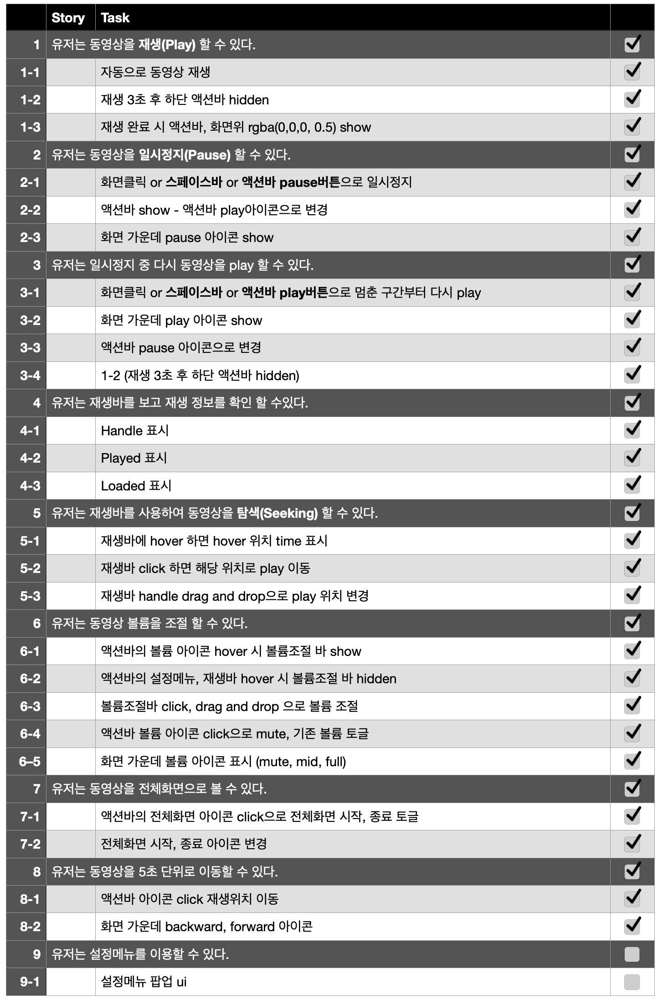
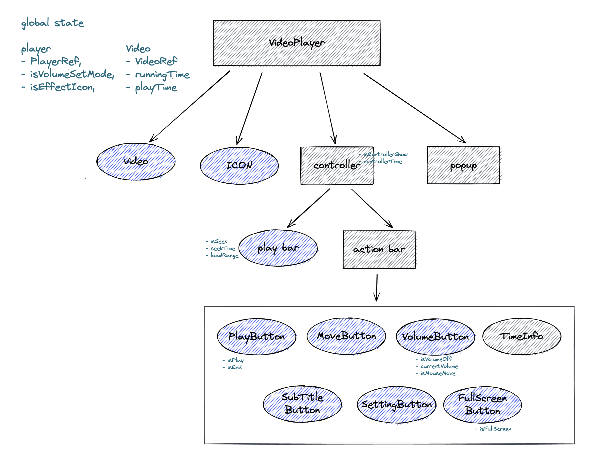

# Web Video Player

## 목차

1. [실행](#실행)
1. [설계](#설계)
1. [구현 과정](#구현-과정)

<br>

# 실행

1. 비디오 다운로드 [🔗다운로드 링크](https://bit.ly/3jERs4o)

```
비디오 다운로드 후 'web-video-player/src/Assets/video' 폴더에 넣기
```

2. 디렉토리 이동

```
cd web-video-player
```

3. 패키지 설치

```
npm install
```

4. 실행

```
// 개발모드
npm start

// 배포환경 dist 폴더 생성 후 dist/index.html 열기
npm run build
```

<br>

# 설계

1. ## backlog

   

2. ## 구조설계
   

<br>

# 구현 과정

## Play & Pause

- `HTMLMediaElement.paused` 사용하여 toggle 기능 구현

  ```jsx
  video.paused ? video.play() : video.pause();
  ```

- 단축키, 클릭

  1.  플레이 버튼 클릭 후 플레이 버튼에 `focus`되어 스페이스바 `keydown` 이벤트 2번 발생 오류.  
      포커스가 되지 않게 막는 것은 접근성에 좋지 않을 것으로 판단되어 `keydown` 이벤트는 `body`에서 일어나도록 해결
  2.  스페이스바 계속 누르고 있을 경우를 생각해 `event.repeat === true` 일 때 return

  ```jsx
  function controlSpaceKey(event: KeyboardEvent) {
    if (event.code !== 'Space' || event.target !== document.body || event.repeat) return;
    controlVideoPlayback();
  }
  ```

- autoplay❗️
  ```
  Uncaught (in promise) DOMException: play() failed because the user didn't interact with the document first.
  ```
  [크롬 자동 재생 정책](https://developer.chrome.com/blog/autoplay/)에 따라 `muted`가 아닌 상태에서 자동 재생 불가.  
   setTimeOut을 사용하여 재생 후 volume을 변경하려 시도했지만 불가능.  
   volume을 나중에 변경해 줘도 인지하지 못하는 것 같다.  
   -> **volume 초기값을 0으로 설정**

## Volume

- mute  
  `mute`를 해제할 때 이전 볼륨 상태가 0인 경우 계속 `mute` 상태.  
  이런 경우 해제하면 `VOLUME.DEFAULT` 값으로 변경.  
  위에 `autoplay`를 volume 0으로 시작했지만 버튼 클릭하여 `VOLUME.DEFAULT`로 들을 수 있다.

## Drag and Drop

- VolumeRange

  ```
   src/components/VolumeButton/VolumeRange
  ```

  `div`로 rangeSlider ui를 만들고 `onMouseDown`, `onMouseMove`, `onMouseUp` 이벤트를 활용하여 `drag and drop` 구현.
  isMouseMove를 확인하여 드래그 중인지 판별.  
   `event.clientX`와 `VolumeRangeBox` 의 `width,left,right`을 구하여 해당 위치의 퍼센테이지를 구하여 volume 설정.

- Playbar
  ```
  src/components/Playbar
  ```
  `input type="range"` 태그 활용.  
   `Input` 이벤트로 `currentTime`변경하고 `value = playTime`으로 설정하여 겹쳐놓은 PlayBar가 이동될 수 있도록 구현.

## Move

- `VIDEO_INFO.TIME.MOVE` : 컨트롤바 아이콘 버튼 5초 단위로 이동 구현.

## FullScreen

- `requestFullscreen`, `exitFullscreen` 이벤트 사용  
   `ESC` 키로 화면 종료하면 아이콘 변경되지 않음. document에 `fullscreenchange` 이벤트로 해결.
  ```jsx
  function onFullScreenChange() {
    if (document.fullscreenElement) return;
    setIsFullScreen(false);
  }
  ```

## hook

- `useVideo`, `usePlayer`

  ```
   src/context/video/context.tsx
   src/context/player/context.tsx
  ```

  useContext 사용시 초기값 `null`로 인한 ts 에러발생.  
  `useVideo`, `usePlayer`를 만들어 `context === null` 체크.

  ```jsx
  export function useVideo() {
    const context = useContext(VideoContext);
    if (context === null) {
      throw new Error('usePlayer must be used within a VideoProvider');
    }
    return context;
  }
  ```
